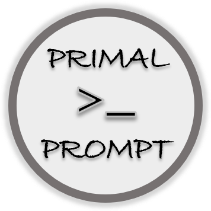

<p align="center">
   
</p>

# Primal Prompt

> ⚙️ ⚙️ Proyecto diseñado por Gerardo Fabián Quispe y realizado con la asistencia de inteligencia artificial (IA), como apoyo en el diseño y la estructuración del código.


## ✨ ¿Qué es *Primal Prompt*?

**Primal Prompt** es una personalización del prompt de Bash en sist 🐧emas Linux, especialmente pensada para usuarios de Ubuntu que trabajan con Git y desean una interfaz más informativa, visualmente clara y agradable de usar en el día a día.

Este proyecto nació de la necesidad de contar con un entorno de línea de comandos más funcional, sin resultar abrumador. Quise desarrollar una herramienta que no solo fuera atractiva, sino también **sobria**, **minimalista** y **elegante** — evitando una saturación de colores o datos innecesarios, pero mostrando lo esencial con precisión.

Con un enfoque limpio y centrado en la experiencia del desarrollador, **Primal Prompt** permite identificar rápidamente la rama activa y el estado del repositorio Git, mejorando el flujo de trabajo sin distraer.


<br>

## ✅ Funcionalidades implementadas (Primera etapa)

1. **Prompt en dos líneas**:

    * Línea 1: `usuario@host:directorio` + `(rama Git)` (si aplica)
    * Línea 2: `$` con el cursor al lado.

2. **Nombre de rama Git** (si estás en un proyecto Git):

    * Aparece entre **corchetes "[ ]"**.
    * En el **color Cian fuerte** (🔵).
    * Si **no hay Git**, no muestra nada.

3. Indicadores de **estado Git**, entre parentesis **( )**:
    * Archivos modificados (M)
    * Archivos staged (S)
    * Archivos no rastreados (U)
    * Distinción de los estados mediante **colores**.
    * Se muestra la cantidad de archivos en los tres estados.

4. **Salto de línea antes del prompt** para mejor legibilidad.
    * Inserción automática de **líneas en blanco entre comandos ejecutados**.
    * Pero **no al abrir la terminal por primera vez** o presionar solo **Enter**.

<br>

---


## 👁️ Elementos visuales del prompt

El prompt se compone así:

```bash
usuario@MiPC:/ruta ⎇[rama] (M:x S:x U:x)
$
```

Con cada segmento coloreado y formateado para facilitar la lectura.

<br>

---


## 🎨 Tablas de colores y símbolos

### 🗂️ Colores usados en el prompt

| Elemento                        | Código de color ANSI | Color  | Descripción                        |
|--------------------------------|----------------------|--------|------------------------------------|
| Usuario y host (`\u@\h`)       | `\033[01;32m`        | 🟢 Verde  | Para destacar el usuario conectado |
| Ruta actual (`\w`)             | `\033[01;34m`        | 🔵 Azul   | Para mostrar el directorio activo  |
| Rama Git actual                | `\033[1;36m`         | 🟦 Celeste| Identificador de rama (`⎇[main]`) |
| Texto por defecto              | `\033[0m`            | ⚪ Gris   | Restaura el color a normal         |

### 📁 Colores para estados de Git

| Estado       | Simbolo | Color   | Código ANSI      | Descripción                                    |
|--------------|--------|----------|------------------|------------------------------------------------|
| Modificados  | `M:x`  | 🔴 Rojo  | `\[\033[0;31m\]` | Archivos que fueron editados pero no stageados |
| Staged       | `S:x`  | 🟢 Verde | `\[\033[0;32m\]` | Archivos preparados para commit                |
| Untracked    | `U:x`  | ⚪ Gris  | `\[\033[0;37m\]` | Archivos nuevos no seguidos por Git            |

<br>

---


## 📦 Instalación (Primera etapa)

1. Abrí la terminal.
2. Ejecutá el siguiente comando para abrir el archivo `.bashrc` (si usás Bash) o `.zshrc` (si usás Zsh):

```bash
nano ~/.bashrc
```
ó
```bash
nano ~/.zshrc
```

3. Copiá y pegá el contenido del archivo `primal-prompt.sh` dentro del archivo al final.

4. Guardá los cambios con `Ctrl + O`, **presioná `Enter` para confirmar**, y salí con `Ctrl + X`.

5. Aplicá los cambios:

```bash
source ~/.bashrc
```
ó
```bash
source ~/.zshrc
```

<br>

---


## 💡 Ejemplos de cómo se ve en la terminal

**Dentro de un proyecto Git:**

```bash
usuario@MiPC:~/Documentos/mi-proyecto ⎇[main] (M:2 S:1 U:1)
$ 
```

```bash
usuario@MiPC:~/Dev/test ⎇[feature-ui] (S:3)
$ 
```

**Fuera de un proyecto Git:**

```bash
usuario@MiPC:~ 
$ 
```

```bash
usuario@MiPC:~/Documentos
$ 
```

**Después de ejecutar un comando:**

```bash
usuario@MiPC:~ 
$ echo "Hola"
Hola

usuario@MiPC:~ 
$ ls
archivo.txt

```

**Después de presionar Enter:**

```bash
usuario@MiPC:~ 
$ 
usuario@MiPC:~ 
$ 

```

<br>

---

## 📌 Nota adicional

Este proyecto es modular y escalable. En futuras etapas se incluirán:

- Soporte para temas intercambiables (paletas de colores).
- Script de instalación automática (`install.sh`) y desinstalación.
- Compatibilidad con Zsh y otras shells.
- Selector de temas interactivo.

Gracias por usar **Primal Prompt** 🙌

<br>

---

## 📝 Licencia

Este proyecto está licenciado bajo los términos de la [Licencia MIT](./LICENSE).  
© 2025 Gerardo Fabián Quispe

<br>

---

<br>


<p align="center">
   
</p>

<p align="center">
   <b>Primal Prompt</b> — Simple. Elegante. Funcional.
</p>


